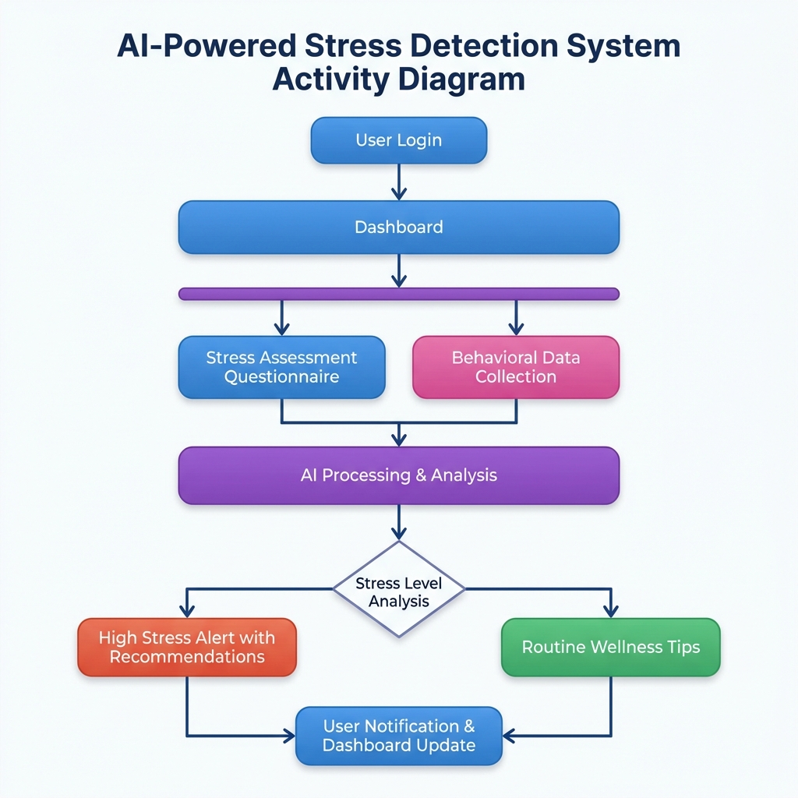
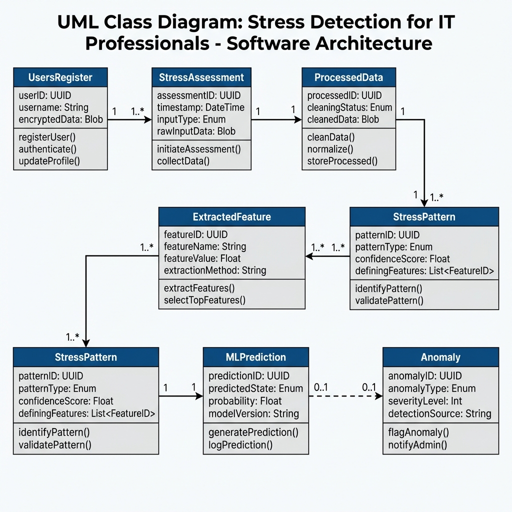
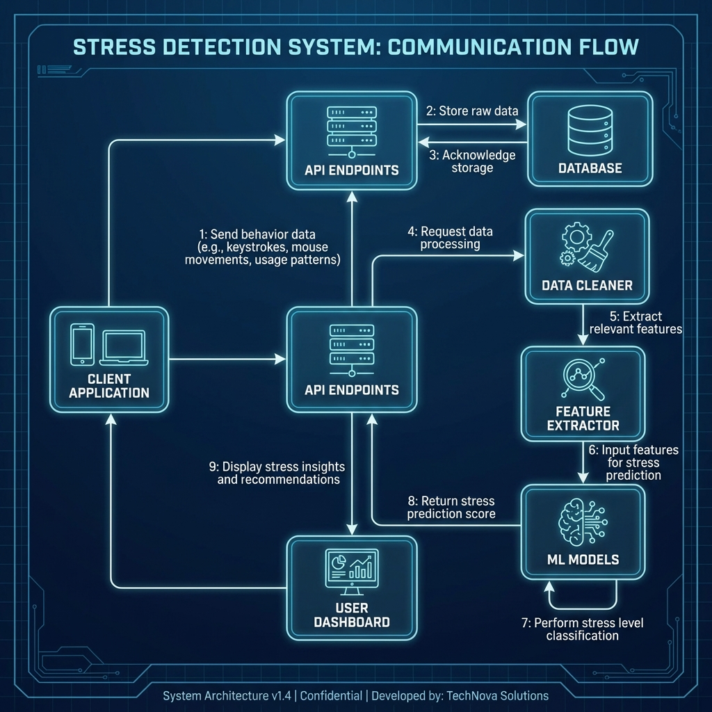
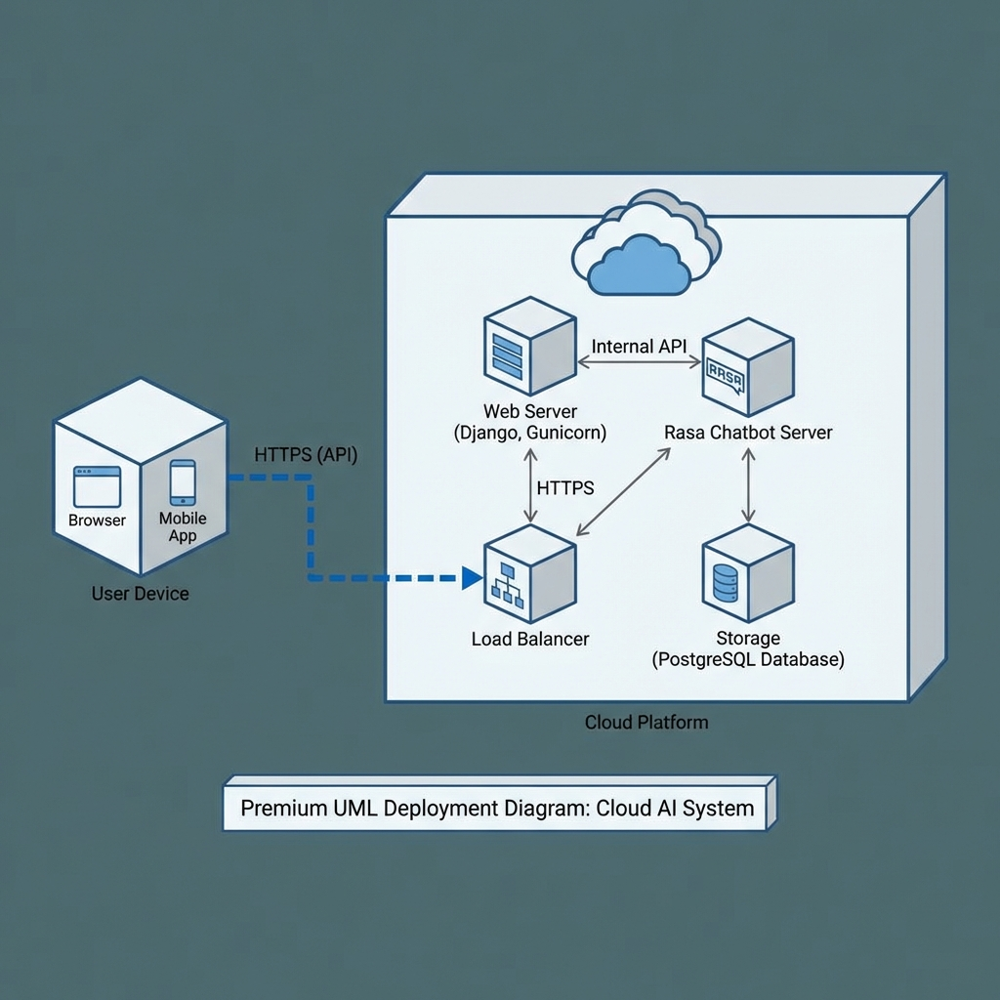

# 🎯 𝕊𝕋ℝ𝔼𝕊𝕊 𝔻𝔼𝕋𝔼ℂ𝕋𝕀𝕆ℕ 𝔽𝕆ℝ 𝕀𝕋 𝔓ℝ𝕆𝔽𝔼𝕊𝕊𝕀𝕆ℕ𝔸𝕃𝕊 🧠

> **An AI-powered wellness ecosystem designed to monitor, detect, and mitigate stress in the high-pressure technology industry.**

[](https://www.python.org/)
[](https://www.djangoproject.com/)
[](https://rasa.com/)
[](LICENSE)

---

## 📘 1. Project Overview

In the modern IT landscape, chronic stress often leads to burnout. This project provides a **proactive monitoring system** that transforms digital behavior (typing speed, screen time) and biometric data (heart rate, sleep) into actionable mental health insights. It features an integrated **AI Chatbot** for real-time support and a comprehensive **Analytics Dashboard** for both developers and managers.

---

## 🎨 2. System Architecture & Diagrams

### 🗺️ Activity Flow
Shows the user journey from login to receiving personalized recommendations.


### 🏗️ Class Architecture
The core data structure and relationships between users, stress patterns, and AI predictions.


### 📈 Communication Flow
Interaction between system components for stress detection.


### 🌐 Deployment Model
Physical infrastructure involving Django web servers, Rasa AI servers, and cloud databases.


---

## ✨ 3. Key Features

*   **🔍 Multi-Modal Stress Tracking**: Monitoring via Keyboard activity, Screen time classification, Voice pitch analysis, and Wearable data (Heart Rate/Sleep).
*   **🤖 Conversational AI (Rasa)**: A empathetic chatbot providing immediate mindfulness exercises and stress-reduction tips.
*   **⚖️ ML Anomaly Detection**: Uses **Isolation Forest** and **DBSCAN** to identify unusual stress-triggering habits.
*   **📊 Personalized Dashboards**: Interactive charts and health scores for professionals.
*   **🔔 Real-time Alerts**: Automatic notifications triggered by high-stress behavioral patterns.
*   **📚 Resource Hub**: Curated library of mindfulness videos, research papers, and articles.

---

## 🚀 4. Installation & Setup

### **Prerequisites**
*   **Python 3.9** (3.8+ supported)
*   Git
*   PowerShell (Windows) or bash (Linux/macOS)

### **Quick Setup Guide**
1.  **Clone the Repository**:
    ```bash
    git clone https://github.com/suragsunil/STRESS-DETECTION-FOR-IT-PROFESSIONALS.git
    cd STRESS-DETECTION-FOR-IT-PROFESSIONALS/strees_dection
    ```

2.  **Environment Setup**:
    ```bash
    python -m venv venv
    .\venv\Scripts\Activate.ps1   # Windows PowerShell
    # venv\Scripts\activate.bat    # Windows CMD
    # source venv/bin/activate    # Linux/Mac
    ```

3.  **Install Dependencies**:
    ```bash
    pip install --upgrade pip
    pip install -r requirements.txt
    ```

4.  **Database Migration**:
    ```bash
    python manage.py migrate
    python manage.py collectstatic --noinput   # optional, for static files
    ```

---

## ▶️ 5. Running the System

Run these **three services** in separate terminals (all from the `strees_dection` directory):

| Terminal | Service | Command |
| :--- | :--- | :--- |
| **1** | **Django Web App** | `python manage.py runserver` *(activate venv first)* |
| **2** | **Rasa Action Server** | `rasa run actions --port 5055` |
| **3** | **Rasa Core API** | `rasa run --enable-api --cors "*" --port 5005` |

**Windows:** You can use the batch files: `start-django.bat`, `start-rasa-actions.bat`, `start-rasa-core.bat`.

| URL | Service |
| :--- | :--- |
| **http://127.0.0.1:8000** | Django web app |
| **http://localhost:5005** | Rasa API |
| **http://localhost:5055** | Rasa actions |

📖 **Detailed run guides:** [HOW-TO-RUN-DJANGO.md](HOW-TO-RUN-DJANGO.md) · [HOW-TO-RUN-RASA.md](HOW-TO-RUN-RASA.md) · [HOW-TO-RUN.md](HOW-TO-RUN.md) (full system)

---

## 🛠️ 6. Tech Stack

*   **Backend**: Django, REST Framework
*   **AI/ML**: Scikit-Learn, Rasa, Librosa (Audio), Pandas, NumPy
*   **Frontend**: HTML5, Vanilla CSS (Premium Glassmorphism), JavaScript
*   **Database**: SQLite (SQL)

---

## 🎌 7. Conclusion

This project moves mental health support from reactive to **preventative**. By bridging the gap between digital activity and psychological well-being, we empower IT professionals to lead healthier, more balanced tech careers.

---

## 👤 8. About the Founder

<p align="center">
  
  <br>
  <b>Surag M S</b><br>
  Founder of AI-Powered Stress Detection for IT Professionals
</p>

*   **GitHub**: [@suragms](https://github.com/suragms)
*   **Portfolio**: [suragsunil.github.io](https://suragsunil.github.io)
*   **LinkedIn**: [in/suragsunil](https://linkedin.com/in/suragsunil)

---
> 💡 *“Helping IT professionals stay mentally healthy — one insight at a time.”*
